# Descifrando la Guerra — App Móvil

App móvil no oficial para [Descifrando la Guerra](https://www.descifrandolaguerra.es), medio de análisis y noticias de política internacional. Desarrollada en Flutter para Android e iOS.

---

## Capturas de pantalla

### Inicio y lectura
<p align="center">
  
  
  
  
</p>

### Regiones y mapas
<p align="center">
  
  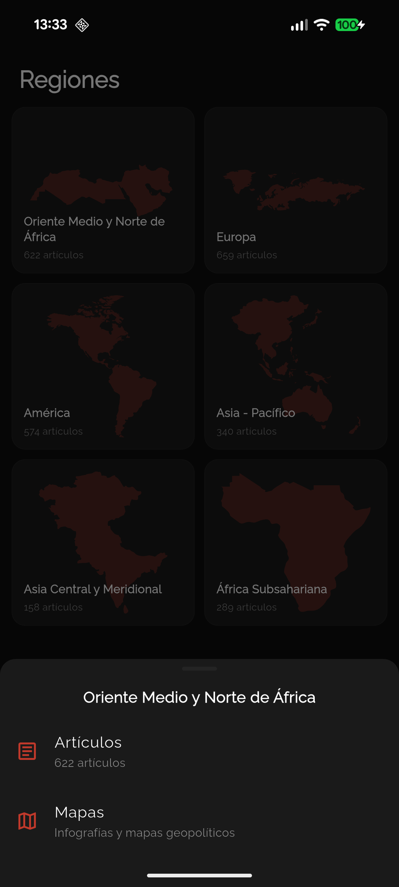
  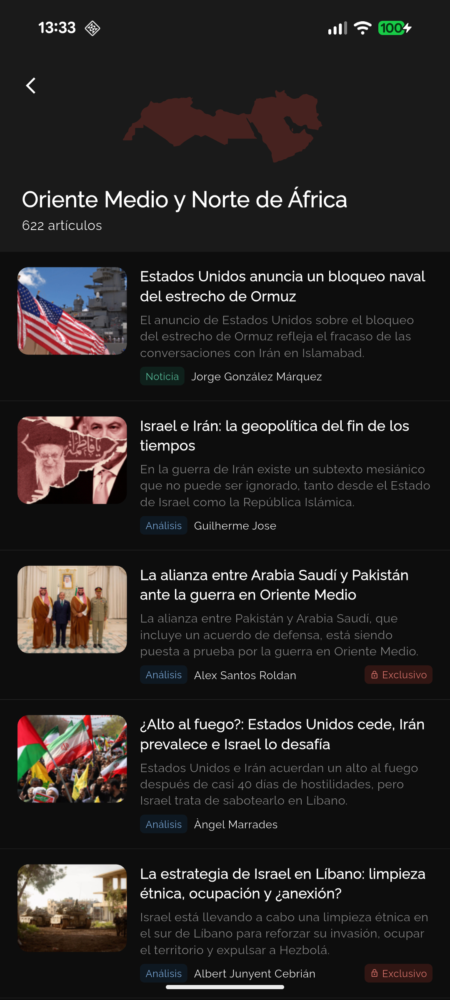
  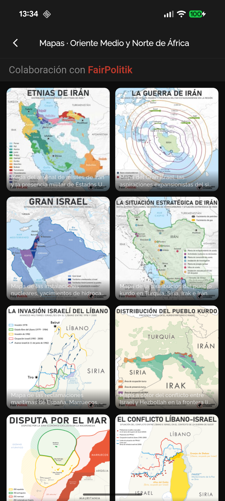
</p>

### Explorar
<p align="center">
  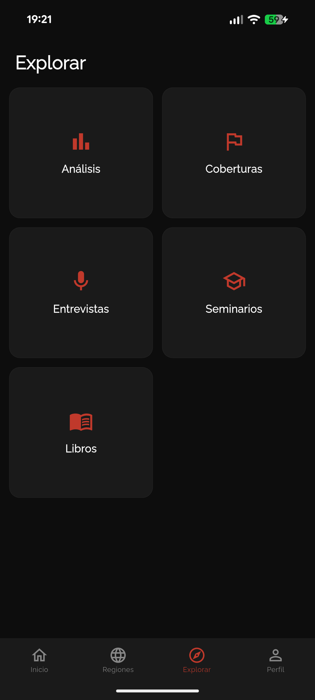
  
  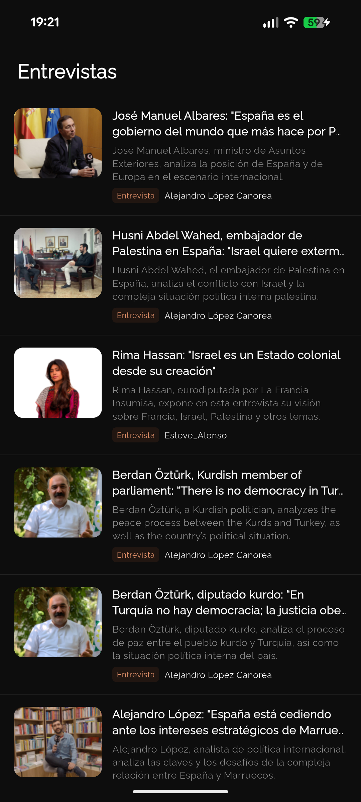
  
</p>

### Coberturas
<p align="center">
  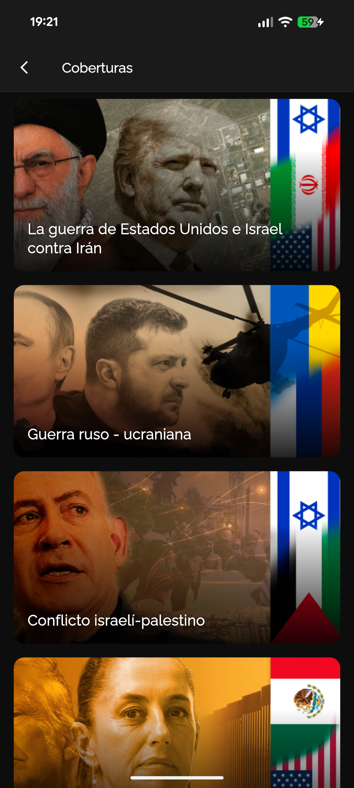
  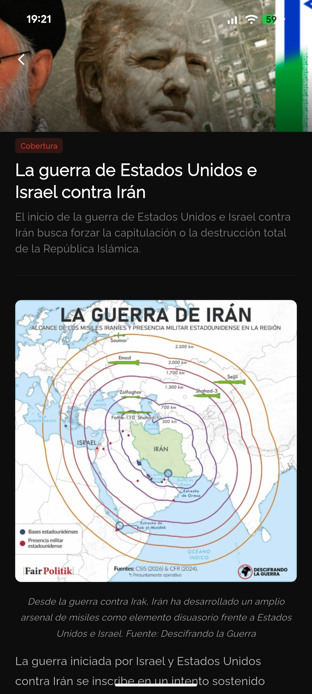
</p>

### Seminarios
<p align="center">
  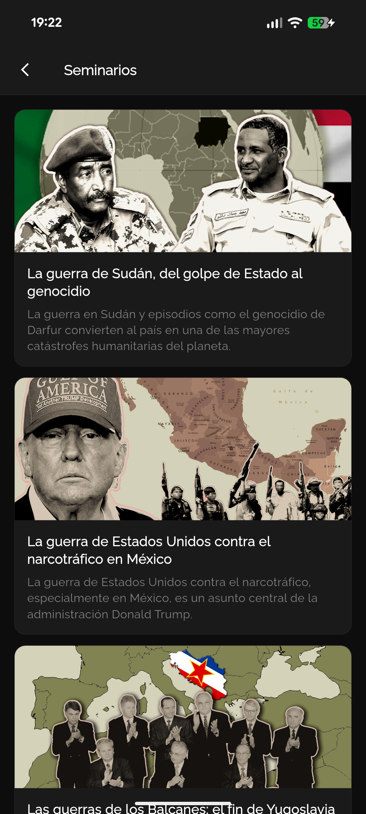
  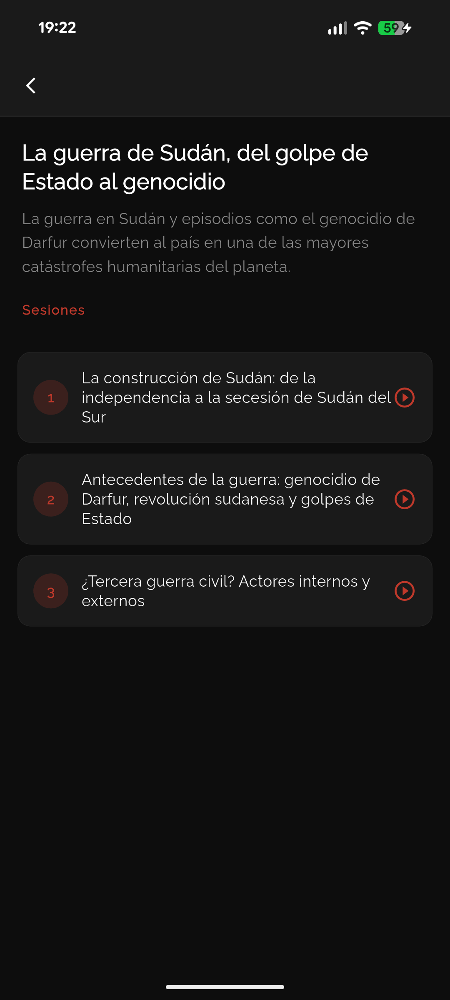
  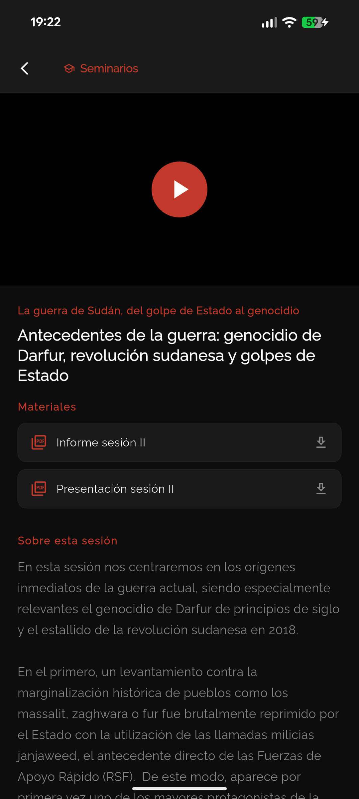
</p>

### Libros
<p align="center">
  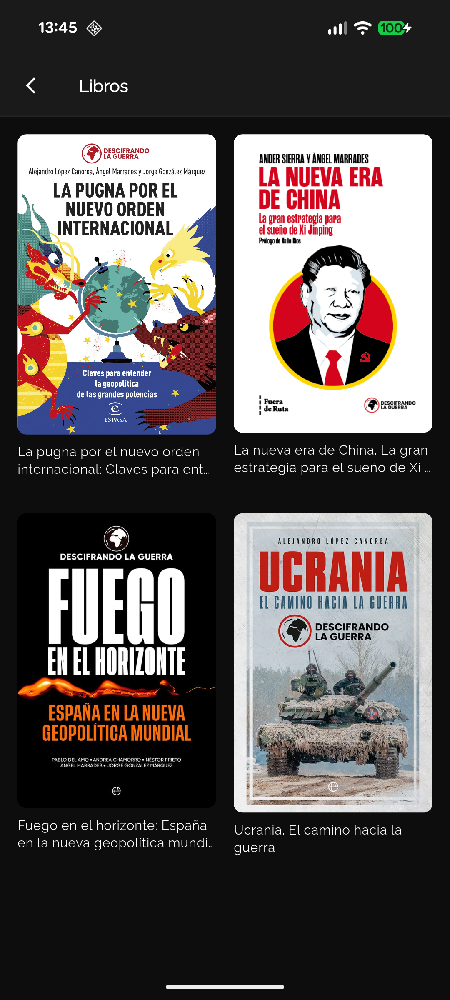
  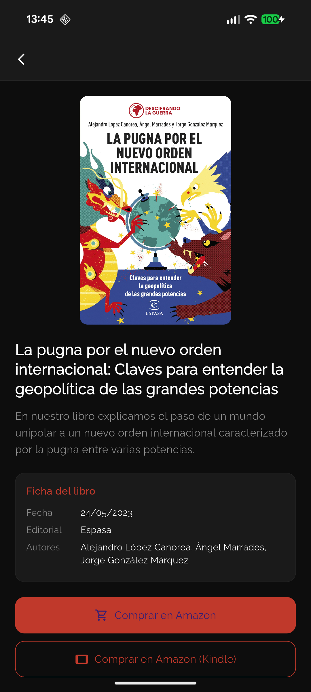
</p>

### Perfil y cuenta
<p align="center">
  
  
  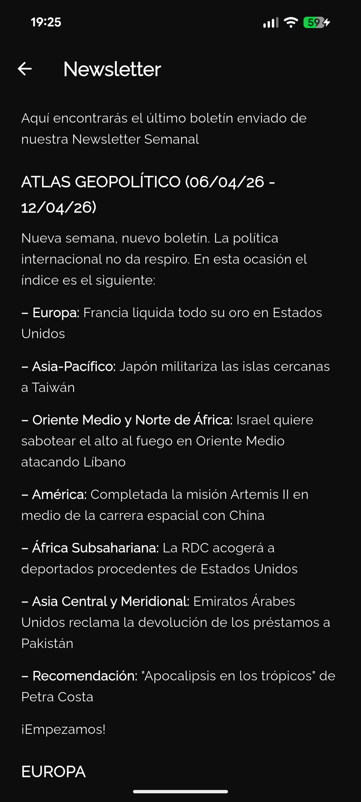
  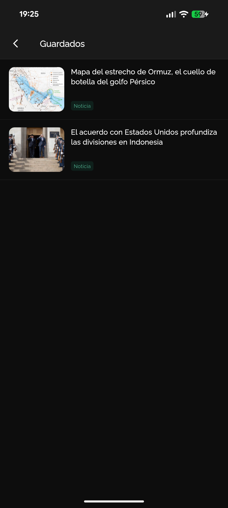
  
</p>

---

## Características

- **Noticias, Análisis y Entrevistas** con paginación infinita y caché inteligente
- **Coberturas** — seguimiento de conflictos y eventos con contenido HTML enriquecido
- **Seminarios** — acceso a sesiones con vídeo Vimeo y materiales descargables
- **Newsletter** — último boletín semanal disponible en la app para suscriptores
- **Artículos Guardados** — sincronización de favoritos con el servidor
- **Secciones por región geográfica** (Oriente Medio, Europa, América, Asia...)
- **Mapas geopolíticos** por región en colaboración con FairPolitik
- **Buscador** con sugerencias en tiempo real y badge de contenido exclusivo
- **Libros** con ficha técnica y enlaces de compra en Amazon y Kindle
- **Autenticación segura** — las credenciales se introducen en la web oficial a través de un WebView seguro, nunca pasan por la app
- **Contenido exclusivo** para suscriptores con detección automática de membresía
- **Firebase Analytics** integrado de forma opcional — sin credenciales la app funciona sin Analytics
- **Tema claro y oscuro** con paleta inspirada en papel periódico
- **5 fuentes tipográficas** optimizadas para lectura (Raleway, Lora, Merriweather, Source Sans, Crimson Pro)
- **Ajuste de tamaño de texto** en 5 niveles
- **Compartir artículos** directamente desde el detalle
- **Indicador de conectividad** con animación al recuperar la conexión

---

## Tecnologías

| Categoría | Tecnología |
|-----------|-----------|
| Framework | Flutter 3.x / Dart |
| Estado | Provider + ChangeNotifier |
| Red | http + LoggingHttpClient |
| Caché | flutter_secure_storage (EncryptedSharedPreferences) |
| Imágenes | cached_network_image |
| Autenticación | flutter_inappwebview + cookies de sesión |
| HTML | flutter_html |
| SVG | flutter_svg |
| Fuentes | google_fonts |
| Conectividad | connectivity_plus |
| Compartir | share_plus |
| Analytics | firebase_analytics (opcional) |

---

## Arquitectura

```
lib/
├── main.dart                    # Punto de entrada, providers, precarga
├── firebase_options.dart.example # Plantilla para configurar Firebase
├── models/
│   ├── article.dart
│   ├── article_detail.dart
│   ├── auth_exception.dart
│   ├── auth_state.dart
│   ├── book.dart
│   ├── coverage.dart
│   ├── map_image.dart
│   ├── region.dart
│   └── seminar.dart
├── repositories/
│   ├── article_repository.dart
│   ├── coverage_repository.dart
│   ├── maps_repository.dart
│   └── seminar_repository.dart
├── screens/
│   ├── home_screen.dart
│   ├── analysis_screen.dart
│   ├── interviews_screen.dart
│   ├── coverages_screen.dart
│   ├── coverage_detail_screen.dart
│   ├── seminars_screen.dart
│   ├── seminar_detail_screen.dart
│   ├── seminar_session_screen.dart
│   ├── newsletter_screen.dart
│   ├── saved_articles_screen.dart
│   ├── regions_screen.dart
│   ├── region_articles_screen.dart
│   ├── region_maps_screen.dart
│   ├── article_detail_screen.dart
│   ├── books_screen.dart
│   ├── search_screen.dart
│   ├── explore_screen.dart
│   ├── profile_screen.dart
│   ├── settings_screen.dart
│   ├── login_webview.dart
│   └── main_screen.dart
├── services/
│   ├── analytics_service.dart
│   ├── article_cache.dart
│   ├── auth_notifier.dart
│   ├── auth_service.dart
│   ├── connectivity_service.dart
│   ├── favorites_service.dart
│   ├── logging_http_client.dart
│   └── theme_notifier.dart
├── theme/
│   └── app_colors.dart
└── widgets/
    ├── access_dialog.dart
    ├── article_card.dart
    ├── image_viewer.dart
    └── offline_banner.dart
```

---

## Firebase Analytics (opcional)

La app soporta Firebase Analytics de forma completamente opcional. Sin los archivos de configuración compila y funciona con normalidad.

Para activarlo:

```bash
# 1. Instalar FlutterFire CLI
dart pub global activate flutterfire_cli

# 2. Configurar con tu proyecto Firebase
flutterfire configure --project=TU_PROJECT_ID
```

Esto genera `lib/firebase_options.dart` — **no subir a git** (ya está en `.gitignore`).

Para contribuidores sin Firebase, copiar la plantilla:
```bash
cp lib/firebase_options.dart.example lib/firebase_options.dart
```

---

## Seguridad

- Las **credenciales nunca son vistas por la app** — el login se realiza en un WebView que apunta directamente a la web oficial
- Solo se almacenan **cookies de sesión**, nunca usuario ni contraseña
- Las cookies se persisten con **EncryptedSharedPreferences** (cifrado a nivel hardware en Android)
- Todas las peticiones usan **HTTPS**
- El nonce REST se renueva automáticamente al detectar expiración (HTTP 401)
- Los archivos de Firebase, keystores de firma y certificados iOS están en `.gitignore`

---

## Instalación y desarrollo

### Requisitos

- Flutter SDK 3.0+
- Dart 3.0+
- Android SDK (minSdkVersion 23)

### Configuración

```bash
# Clonar el repositorio
git clone https://github.com/RubenGolfe98/descifra_app.git
cd descifra_app

# Instalar dependencias
flutter pub get

# Generar splash screen nativa
dart run flutter_native_splash:create

# Ejecutar en modo debug
flutter run
```

### Tests

```bash
# Ejecutar todos los tests
flutter test

# Con reporte de cobertura
flutter test --coverage

# Archivo específico
flutter test test/models/article_test.dart
```

```
test/
├── models/
│   ├── article_test.dart
│   ├── article_detail_test.dart
│   ├── auth_exception_test.dart
│   ├── auth_state_test.dart
│   ├── book_test.dart
│   ├── coverage_test.dart
│   ├── map_image_test.dart
│   ├── region_test.dart
│   └── seminar_test.dart
├── repositories/
│   ├── article_repository_test.dart
│   ├── coverage_repository_test.dart
│   ├── maps_repository_test.dart
│   └── seminar_repository_test.dart
├── services/
│   ├── analytics_service_test.dart
│   ├── auth_notifier_test.dart
│   ├── favorites_service_test.dart
│   ├── logging_http_client_test.dart
│   └── theme_notifier_test.dart
└── theme/
    └── app_colors_test.dart
```

### Build de producción

```bash
# APK
flutter build apk --release

# App Bundle (recomendado para Google Play)
flutter build appbundle --release
```

---

## API

La app consume la **WordPress REST API v2** de descifrandolaguerra.es:

| Endpoint | Uso |
|----------|-----|
| `GET /wp/v2/posts` | Listado de artículos, análisis y entrevistas |
| `GET /wp/v2/posts/{id}` | Detalle de artículo |
| `GET /wp/v2/posts?region={id}` | Artículos por región |
| `GET /wp/v2/posts?categories=255` | Análisis |
| `GET /wp/v2/posts?categories=271` | Entrevistas |
| `GET /wp/v2/posts?search={q}` | Búsqueda |
| `GET /wp/v2/cobertura` | Listado de coberturas |
| `GET /wp/v2/cobertura/{id}` | Detalle de cobertura |
| `GET /wp/v2/seminario` | Listado de seminarios |
| `GET /wp/v2/sesion-seminario` | Sesiones de seminario |
| `GET /wp/v2/libro` | Listado de libros |
| `GET /wp/v2/pages/2620` | Página de mapas (HTML parsing) |
| `GET /wp-admin/admin-ajax.php?action=rest-nonce` | Nonce REST |
| `POST /wp-admin/admin-ajax.php` | Favoritos (Simple Favorites plugin) |
| `GET /mi-cuenta/` | Membresía y newsletter (HTML parsing) |

---

## Licencia

Proyecto privado. Todos los derechos reservados.

El contenido mostrado pertenece a [Descifrando la Guerra](https://www.descifrandolaguerra.es).