# Descifrando la Guerra — App Móvil

App móvil no oficial para [Descifrando la Guerra](https://www.descifrandolaguerra.es), medio de análisis y noticias de política internacional. Desarrollada en Flutter para Android y IOS.

---

## Capturas de pantalla

### Inicio y lectura
<p align="center">
  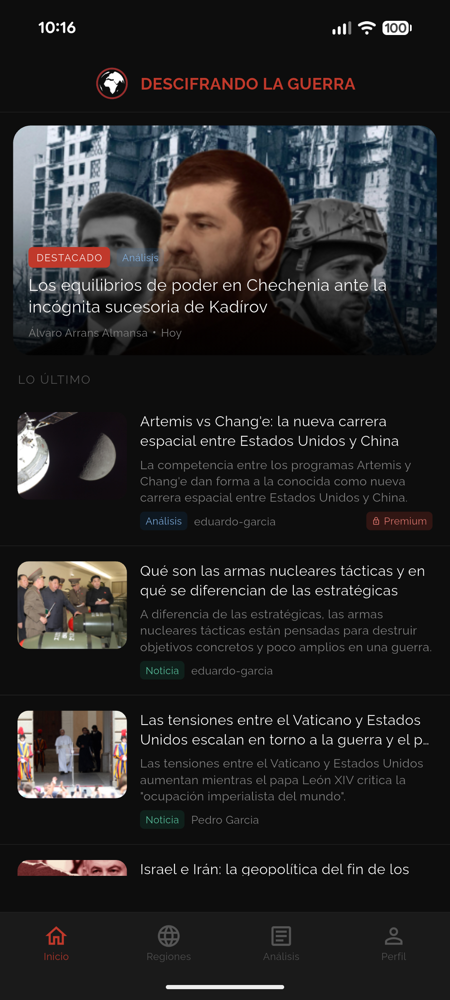
  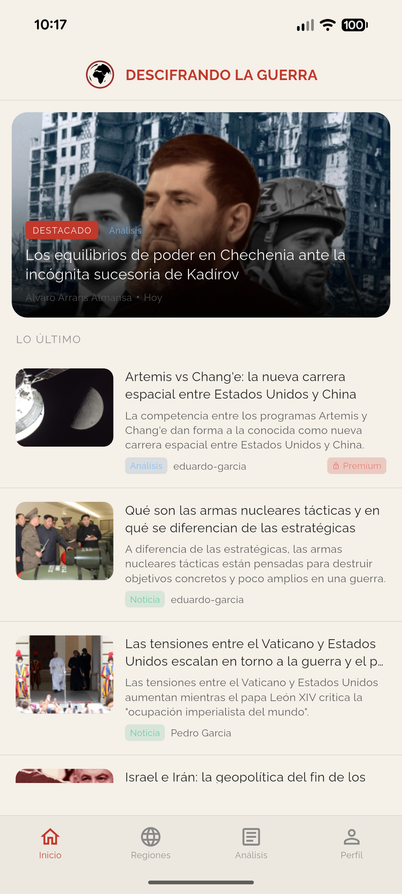
  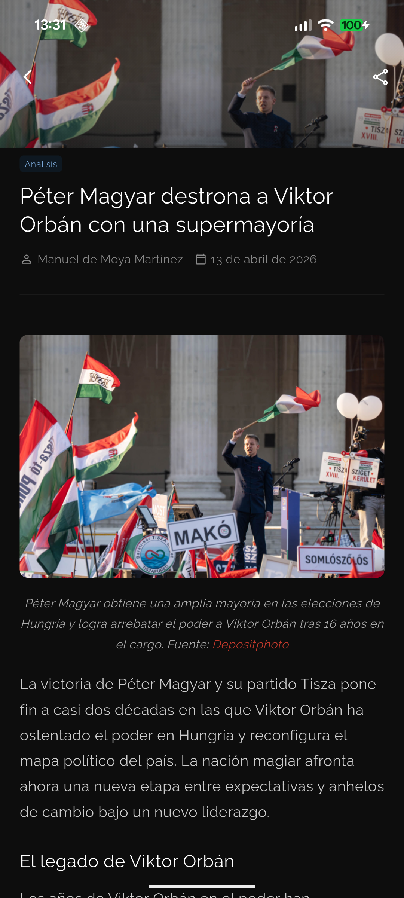
  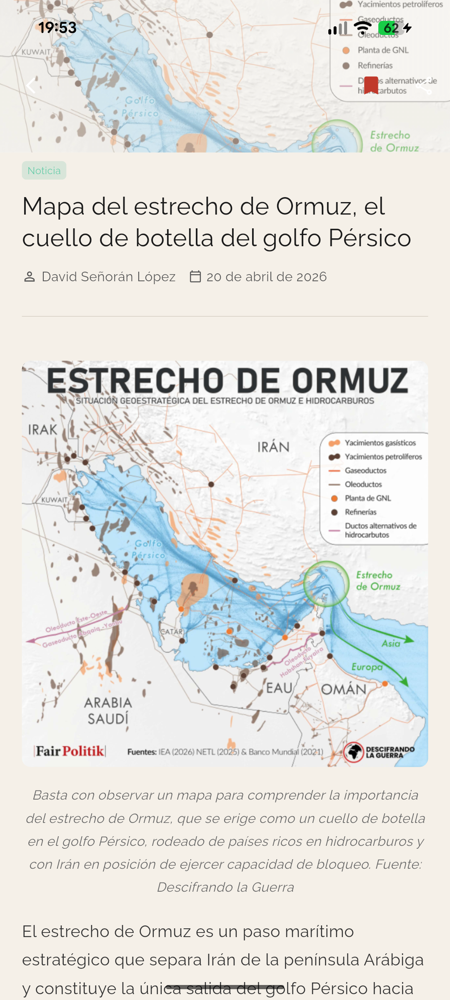
</p>

### Secciones
<p align="center">
  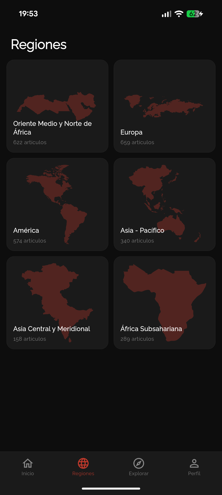
  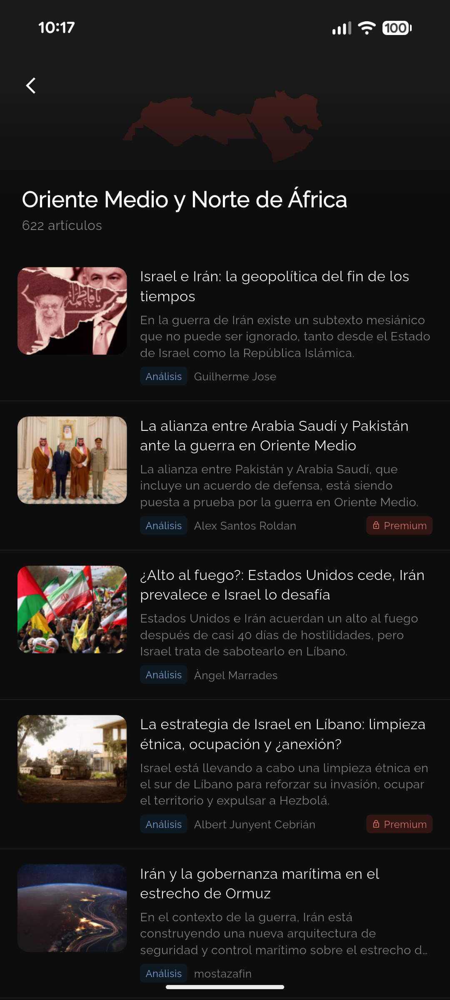
  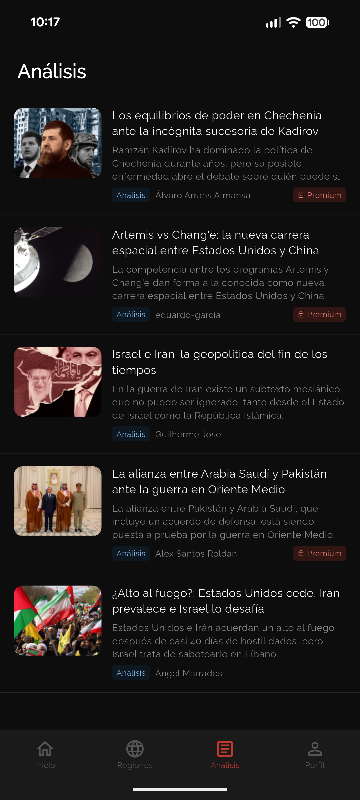
</p>

### Perfil, ajustes y acceso
<p align="center">
  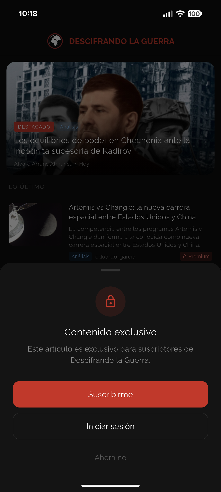
  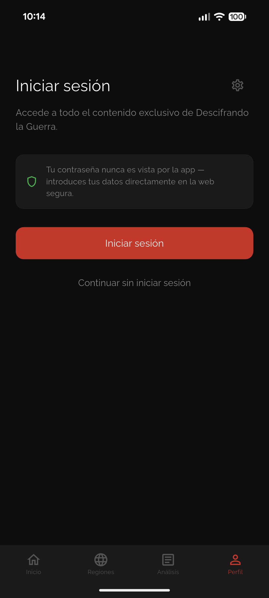
  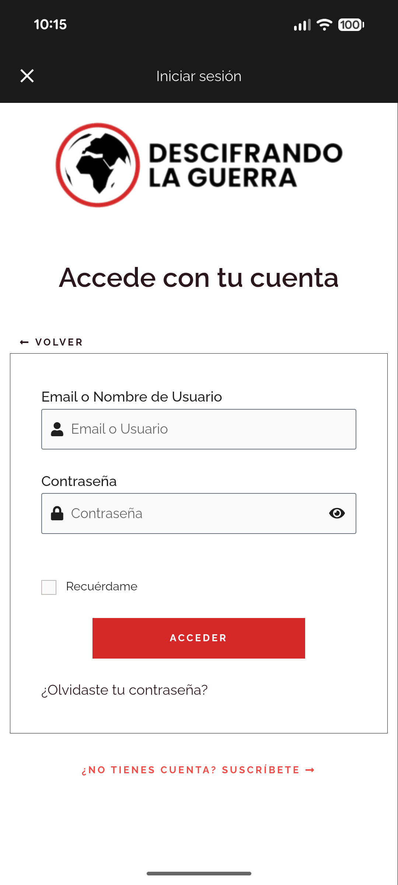
  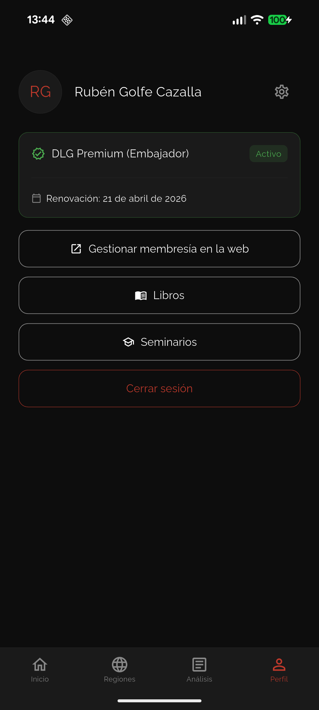
  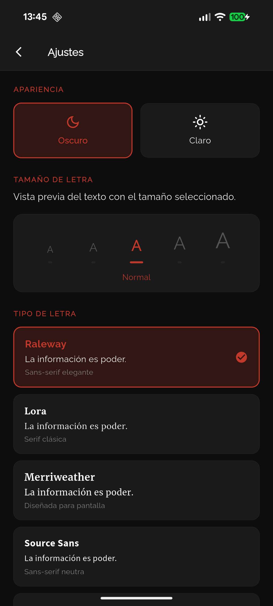
</p>

---

## Características

- **Listado de noticias y análisis** con paginación infinita
- **Detalle de artículos** con contenido HTML renderizado
- **Secciones por región geográfica** (Oriente Medio, Europa, América, Asia...)
- **Autenticación segura** — las credenciales se introducen directamente en la web oficial a través de un WebView, nunca pasan por la app
- **Contenido premium** para suscriptores con detección automática de membresía
- **Caché local inteligente** — los artículos se cargan instantáneamente en segundos accesos y se actualizan en segundo plano
- **Tema claro y oscuro** con paleta inspirada en papel periódico
- **5 fuentes tipográficas** optimizadas para lectura (Raleway, Lora, Merriweather, Source Sans, Crimson Pro)
- **Ajuste de tamaño de texto** en 5 niveles
- **Compartir artículos** directamente desde el detalle
- **Indicador de conectividad** con animación al recuperar la conexión
- **Navegación interna** — los enlaces a otros artículos de la web abren directamente en la app

---

## Tecnologías

| Categoría | Tecnología |
|-----------|-----------|
| Framework | Flutter 3.x / Dart |
| Estado | Provider + ChangeNotifier |
| Red | http + LoggingHttpClient |
| Caché | flutter_secure_storage (EncryptedSharedPreferences) |
| Imágenes | cached_network_image |
| Autenticación | flutter_inappwebview + cookies de sesión |
| HTML | flutter_html |
| SVG | flutter_svg |
| Fuentes | google_fonts |
| Conectividad | connectivity_plus |
| Compartir | share_plus |

---

## Arquitectura

```
lib/
├── main.dart                    # Punto de entrada, providers globales
├── models/                      # Modelos de datos
│   ├── article.dart
│   ├── article_detail.dart
│   ├── auth_state.dart
│   ├── auth_exception.dart
│   └── region.dart
├── repositories/                # Acceso a datos (API + caché)
│   └── article_repository.dart
├── screens/                     # Pantallas
│   ├── home_screen.dart
│   ├── analysis_screen.dart
│   ├── regions_screen.dart
│   ├── region_articles_screen.dart
│   ├── article_detail_screen.dart
│   ├── profile_screen.dart
│   ├── settings_screen.dart
│   ├── login_webview.dart
│   └── main_screen.dart
├── services/                    # Lógica de negocio
│   ├── auth_service.dart
│   ├── auth_notifier.dart
│   ├── article_cache.dart
│   ├── connectivity_service.dart
│   ├── logging_http_client.dart
│   └── theme_notifier.dart
├── theme/
│   └── app_colors.dart          # Paleta de colores (claro/oscuro)
└── widgets/                     # Widgets reutilizables
    ├── article_card.dart
    ├── offline_banner.dart
    └── paywall_dialog.dart
```

---

## Seguridad

- Las **credenciales nunca son vistas por la app** — el login se realiza en un WebView que apunta directamente a la web oficial
- Solo se almacenan **cookies de sesión**, nunca usuario ni contraseña
- Las cookies se persisten con **EncryptedSharedPreferences** (cifrado a nivel hardware en Android)
- Todas las peticiones usan **HTTPS**
- El nonce REST se renueva automáticamente al detectar expiración (HTTP 401)

---

## Instalación y desarrollo

### Requisitos

- Flutter SDK 3.0+
- Dart 3.0+
- Android SDK (minSdkVersion 23)

### Configuración

```bash
# Clonar el repositorio
git clone https://github.com/tu-usuario/descifra-app.git
cd descifra-app

# Instalar dependencias
flutter pub get

# Generar splash screen nativa
dart run flutter_native_splash:create

# Ejecutar en modo debug
flutter run
```

### Tests

```bash
# Ejecutar todos los tests
flutter test

# Ejecutar con reporte de cobertura
flutter test --coverage

# Ejecutar un archivo específico
flutter test test/models/article_test.dart
```

Los tests cubren modelos, repositorios, servicios y colores:

```
test/
├── models/
│   ├── article_test.dart
│   ├── auth_state_test.dart
│   └── region_test.dart
├── repositories/
│   └── article_repository_test.dart
├── services/
│   ├── auth_notifier_test.dart
│   └── theme_notifier_test.dart
└── theme/
    └── app_colors_test.dart
```

---


```bash
# APK
flutter build apk --release

# App Bundle (recomendado para Google Play)
flutter build appbundle --release
```

---

## API

La app consume la **WordPress REST API v2** de descifrandolaguerra.es:

| Endpoint | Uso |
|----------|-----|
| `GET /wp/v2/posts` | Listado de artículos |
| `GET /wp/v2/posts/{id}` | Detalle de artículo |
| `GET /wp/v2/posts?region={id}` | Artículos por región |
| `GET /wp/v2/posts?categories=255` | Artículos de análisis |
| `GET /wp/v2/posts?slug={slug}` | Buscar por slug |
| `GET /wp-admin/admin-ajax.php?action=rest-nonce` | Obtener nonce REST |
| `GET /mi-cuenta/` | Datos de membresía (HTML parsing) |

---

## Licencia

Proyecto privado. Todos los derechos reservados.

El contenido mostrado pertenece a [Descifrando la Guerra](https://www.descifrandolaguerra.es).
